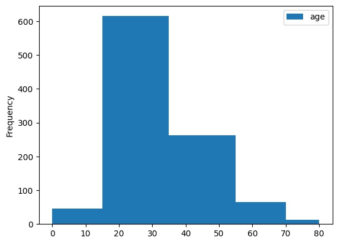
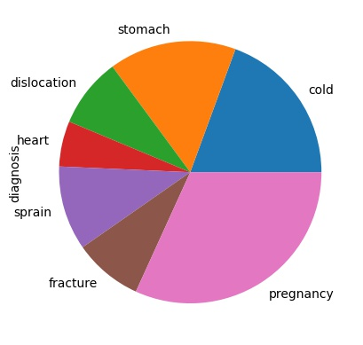

# Data Analysis for Hospitals. Project with Pandas library.

I have have several files with information about local hospitals.
<ol> I did in my program:
<li> Read the CSV files with datasets
<li> Change the column names. The column names of the sports and prenatal tables must match the column names of the general table
<li> Merge the dataframes into one. Use the ignore_index=True parameter and the following order: general, prenatal, sports.
<li> Delete the Unnamed: 0 column
<li> Delete all the empty rows
<li> Correct all the gender column values to f and m respectively
<li> Replace the NaN values in the gender column of the prenatal hospital with f
<li> Replace the NaN values in the bmi, diagnosis, blood_test, ecg, ultrasound, mri, xray, children, months columns with zeros
</ol>
<bold> Some of my results: </bold>
<blink> 1. Photo with visualization common age of a patient among all hospitals. </blink>

<blink> 2. Pie chart of the most common diagnosis among patients in all hospitals. </blink>

